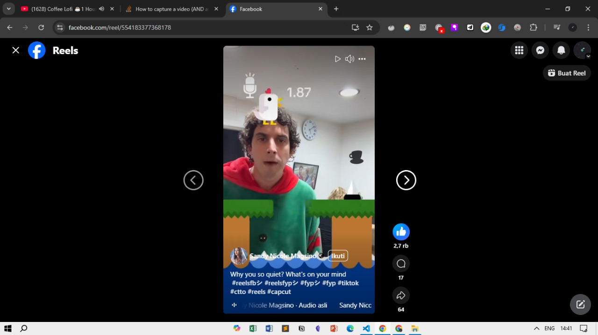

## Notes

One way to achive both record audio and video simultaneously is by doing some threading / parallelism. This article is already discuss this, but it has some problem in Sampling rate / Frame Rate of both Video and Audio

https://stackoverflow.com/questions/14140495/how-to-capture-a-video-and-audio-in-python-from-a-camera-or-webcam

## Notes

The basic prototypes can be running, even though the abstraction was hell of a mess.

Note: There's no way you can use the pygame and opencv to record the frame with threading
since the natrue of the different looping on the both methods (pygame loop vs opencv loop)
If there's some method to do this efficiently, I guess we can do that better

I don't know using the threading by creating a Base class and using inheritence is not working, one way is to inherit from the `threading.Thread` class.

I guess the final form would be like this, so it wasn't an arcade rather than pre-determined stage with some modification.

- The x and y chicken movement is based on some volume detection.
  

## Task

- Making an abstraction of both Video and Audio Recoder class
- Making a game mechanics class for the mario
- Since the program is not an arcade one (infinite). I think we can working on the plotting the map of how the filter should work like in the image
